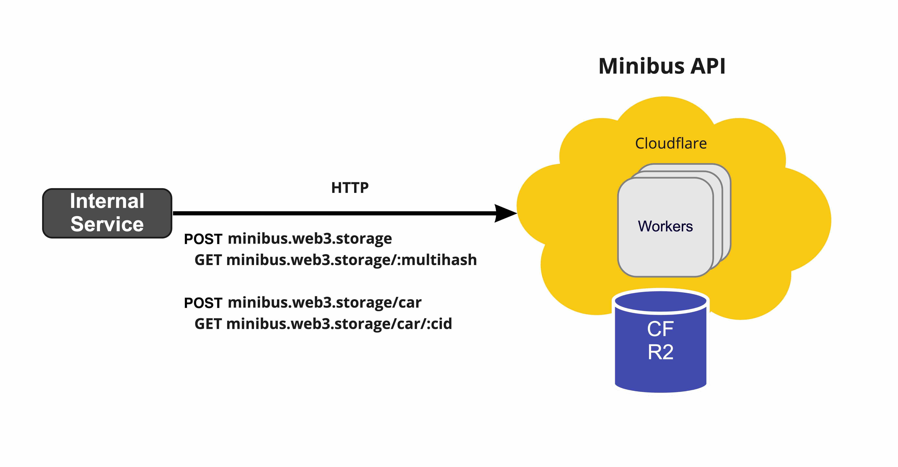

# minibus 🚐

> A edge block service to store IPFS data structures

## Getting started

One time set up of your cloudflare worker subdomain for dev:

- `npm install` - Install the project dependencies from the monorepo root directory
- Sign up to Cloudflare and log in with your default browser.
- `npm i @cloudflare/wrangler -g` - Install the Cloudflare wrangler CLI
- `wrangler login` - Authenticate your wrangler cli; it'll open your browser.
- Copy your cloudflare account id from `wrangler whoami`
- Update `wrangler.toml` with a new `env`. Set your env name to be the value of `whoami` on your system you can use `pnpm start` to run the worker in dev mode for you.

  [**wrangler.toml**](./wrangler.toml)

  ```toml
  [env.bobbytables]
  workers_dev = true
  account_id = "<what does the `wrangler whoami` say>"
  ```

- Add secrets

  ```sh
    wrangler secret put SENTRY_DSN --env $(whoami) # Get from Sentry (not required for dev)
    wrangler secret put LOGTAIL_TOKEN --env $(whoami) # Get from Logtail
    wrangler secret put SALT --env $(whoami) # open `https://csprng.xyz/v1/api` in the browser and use the value of `Data`
  ```

- Add R2 bucket (Note that it is only available as Private Beta at the time of writing)

  ```sh
  wrangler r2 bucket create blockstore --env $(whoami)
  # 🌀  Creating bucket "blockstore"
  # ✨  Success!
  ```

- `npm run publish` - Publish the worker under your env. An alias for `wrangler publish --env $(whoami)`
- `npm dev` - Run the worker in dev mode. An alias for `wrangler dev --env $(whoami)`

You only need to `npm dev` for subsequent runs. PR your env config to the `wrangler.toml` to celebrate 🎉

## High level architecture

The Edge HTTP internal API to store IPFS data structures on R2.



## Usage

You can see full HTTP API specification at https://web3.storage/block-service-docs.

### 🔒 `PUT /`

> Store individuals blocks by multihash in R2.

TODO: curl example

### 🔒 `GET /:multihash`

> Multihash block read interface.

The block data is retrieved and discovered by multihash, in order to enable the same data to be referred to with different codecs.

```sh
curl -X GET -H 'Authorization: Bearer ACCESS_KEY' https://minibus.web3.storage/bciqjhirzogurjzpkzpykrusrktg2gcodyhds7o4zctkhyyhtznublca
```

### 🔒 `PUT /car`

> Store CAR files by writing the blocks to block storage and writing the CAR header and a CARv2 index of the blocks in R2

__TO BE IMPLEMENTED__

### 🔒 `GET /car/:cid`

> CAR read interface.

__TO BE IMPLEMENTED__

## Authentication

Minibus uses JWT tokens for authentication. The SALT needed to create your token can be found in 1password vault for web3.storage project.

You can create your own token by cloning this repo, getting the salt token in an environment variable and run the CLI in this repo as follows:

```sh
SALT=your-salt-secret node scripts/cli.js jwt create
```

For development, Miniflare can be used to run this worker. A global with SALT should be injected in order to allow creation of dev tokens.

## Contributing

Feel free to join in. All welcome. [Open an issue](https://github.com/web3-storage/edge-block-service/issues)!

## License

Dual-licensed under [MIT + Apache 2.0](https://github.com/web3-storage/edge-block-service/blob/main/LICENSE.md)
